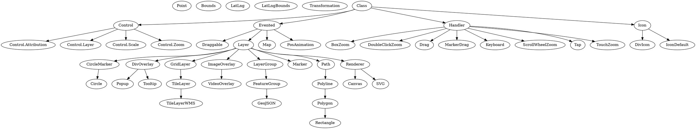

```dot
digraph G {
  Point
  Bounds

  LatLng
  LatLngBounds

  Transformation

  Class -> Control
    Control -> "Control.Attribution"
    Control -> "Control.Layer"
    Control -> "Control.Scale"
    Control -> "Control.Zoom"

  Class -> Evented
    Evented -> Draggable
    Evented -> Layer
      Layer -> CircleMarker
        CircleMarker -> Circle

      Layer -> DivOverlay
        DivOverlay -> Popup
        DivOverlay -> Tooltip

      Layer -> GridLayer
        GridLayer -> TileLayer
          TileLayer -> TileLayerWMS

      Layer -> ImageOverlay
        ImageOverlay -> VideoOverlay

      Layer -> LayerGroup
        LayerGroup -> FeatureGroup
          FeatureGroup -> GeoJSON

      Layer -> Marker
      Layer -> Path
        Path -> Polyline
          Polyline -> Polygon
            Polygon -> Rectangle

      Layer -> Renderer
        Renderer -> Canvas
        Renderer -> SVG

    Evented -> Map
    Evented -> PosAnimation

  Class -> Handler
    Handler -> BoxZoom
    Handler -> DoubleClickZoom
    Handler -> Drag
    Handler -> MarkerDrag
    Handler -> Keyboard
    Handler -> ScrollWheelZoom
    Handler -> Tap
    Handler -> TouchZoom

  Class -> Icon
    Icon -> DivIcon
    Icon -> IconDefault
}
```
